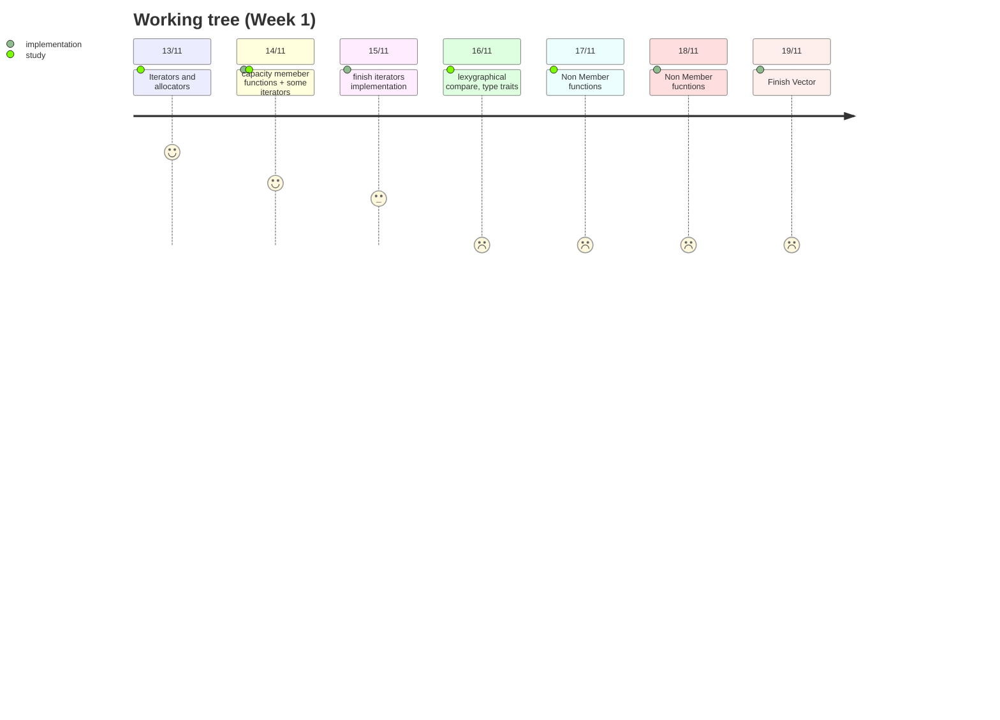

# Containers

In this project we have to reimplement some of STL containers and functionalitys.

 

 They are: 

* Containers:

- [ ] vector
- [ ] map
- [ ] stack

* 
- [x] std::iterator_traits
- [x] std::reverse_iterator
- [ ] std::enable_if (c++11)
- [ ] std::is_integral
- [x] std::equal and/or std::lexicographical_compare
- [ ] std::pair
- [ ] std::make_pair

this needs to be done following the rules ahead:

- [ ] namespace = `ft`
- [ ] You cannot implement more public functions than the ones offered in the standard containers
- [ ] All the member functions, non-member functions and overloads of the standard containers are expected
- [ ] iterator system in containers that have it
- [ ] use std::alocator

All info about project can be found in wiki pages:
* [00. STL recap](https://github.com/sarahmss/Containers/wiki/00.-STL-recap)
* [01. Allocators](https://github.com/sarahmss/Containers/wiki/01.-Allocators)
* [02. Iterators](https://github.com/sarahmss/Containers/wiki/02.-Iterators)
* [03. Vectors](https://github.com/sarahmss/Containers/wiki/03.-Vectors)
* [04. Map](https://github.com/sarahmss/Containers/wiki/04.-Map)
* [05. Stack](https://github.com/sarahmss/Containers/wiki/05.-Stack)

***
### Refs

* [C++ Reference](https://en.cppreference.com/w/)
* [GoogleTests](http://google.github.io/googletest/)
* [Vector](https://www.youtube.com/watch?v=ryRf4Jh_YC0&list=PLlrATfBNZ98dudnM48yfGUldqGD0S4FFb&index=93&ab_channel=TheCherno)
* [How to implement our own Vector Class in C++](https://www.geeksforgeeks.org/how-to-implement-our-own-vector-class-in-c/)

### Progress schedule

 
 Vectors 

